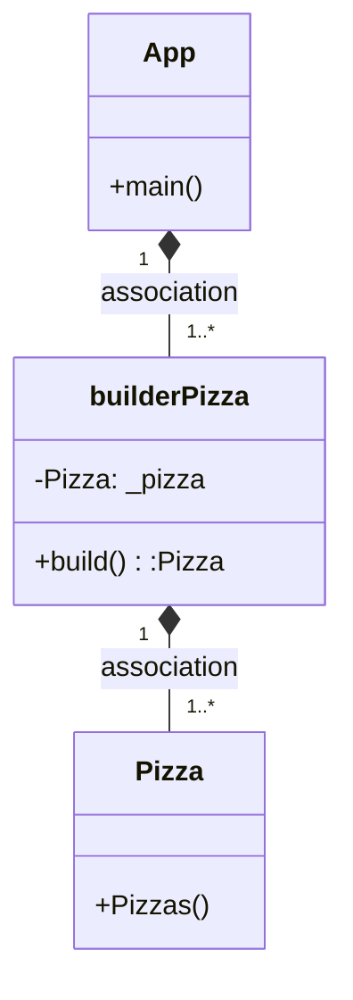

```mermaid
classDiagram
    App "1" *-- "1..*" builderPizza:association
    class App {
        +main()
    }
    class builderPizza {
        -Pizza: _pizza
        
        +build():Pizza
        
    }
   
    
    class Pizza{
        +Pizzas()
    
    }
    builderPizza "1" *-- "1..*" Pizza:association

```