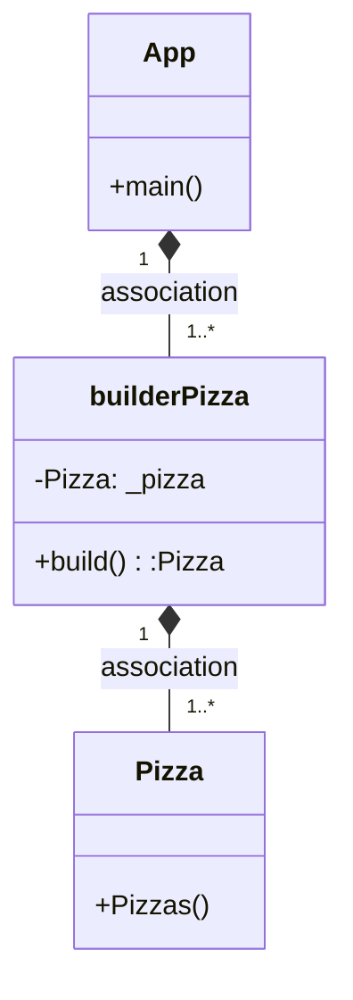
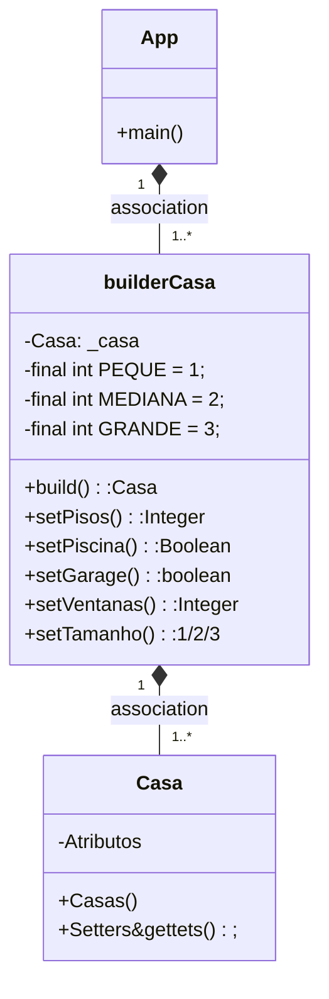

# EXAMEN PARTE DE BUILDER

#### ¿Cual es la función del patrón builder? Pon ejemplo (que no sea Pizzas)

La Función del patrón builder es principalmente permitirnos construir varios objetos partiendo de una estructura
En el ejemplo de las pizzas vimos como tenemos una clase pizza en la cual tenemos todos los métodos
y después tenemos la clase **BuilderPizzas**  en la cual tenemos todos los métodos para construir una pizza
y esa es la clase sobre la que vamos a trabajar.

OTRO EJEMPLO
---

Un buen ejemplo de builder, quizas más visual es el de construir una casa.
Pongamos que tenemos la clase **casa** aquí tenemos los atributos de una casa que pueden ser

    numero de pisos
    numero de ventanas
    si tiene garage o no
    si tiene piscina
    si es grande/mediana/pequeña

Aquí nos podríamos explayar un monton, pero digamos que nosotros tenemos una casa por defecto
    que es la del constructor vacío que es
    
    pequeña
    1 piso
    sin garage
    sin piscina
    con 2 ventanas

cuando instanciamos el builder a esta casa con los metodoso setter podemos modificarla de la manera que queramos

    setPisos(2)
    setGarage(true)
    setPiscina(true)
    setVentanas(5)
    setTamanho(MEDIANA)
    build();

Como podemos comprobar en el ejemplo anterior hemos creado una nueva casa modificando lso atributos de esta
y finalmente la construimos llamando al metodo build, que nos devuelve una casa construida
**BuildCasa**


#### ¿Como es su Diagrama de clases de este ejemplo mque has hecho? Realiza en el readme el diagrama



#### ¿Podríamos combinarlo con el patrón Factory? Explícalo con algo de código como lo harías

Creo que si se podría combinar puesto que sería como si tubiera una empresa de construir casa
en este caso implementaría la interfaz **IConstruccion**
Que la implementarían 3 clases:

    Casa
    Edificio
    Challet

Con el builder podría construir una **casa** de diferentes tipos, como en el ejemplo anterión
Además de poder construir un challet que tendría unos requisitos diferentes y un edificio que le pasa exactamente lo mismo

digamos que una casa e slo que elegimos anteriormente


la clase challet tiene si o si jardín y piscina por lo que sería estupido tener esos atributos a elegir 
con el builder ya que siempre estarían a true.

y el edificio por lo contrario tiene otros como por ejemplo
    
        tienePatio():boolean
        atico():boolean

Todo esto lo podemos hacer con el patrón builder, pero para terminar de implementar factory, porque recordemos que
estamos implementando la interfaz ***IConstrucion*** 

Ahora debemos crear la clase ***FACTORY*** aquí tendrémos un método llamado **getEdificacion()**

esto nos permitirá elegir que tipo de edificacion vamos a construit si una casa un challet o un edificio

y nos devolvería el build() es decir algo ya construido, d eun ***por defecto*** de un challet, una casa o un edificio

y ya una vez devuelto podremos modificarlo en el main en funcion de los intereses del cliente.


# CLASE CASA
```java
public class Casa {
    /**
     * Tenemos las diferentes configuraciones de una casa
     */
    private int numeroPisos;
    private int numeroHabitaciones;
    private int numeroBanios;
    private boolean tieneGaraje;

    /**
     * Constructor parametrizado
     * @param numeroPisos seteamos el numero de pisos de la casa
     * @param numeroHabitaciones seteamos el numero de habitaciones e la casa
     * @param numeroBanios seteamos el numero de baños que tiene la casa
     * @param tieneGaraje seteamos si la casa tiene garage o no
     */
    public Casa(int numeroPisos, int numeroHabitaciones, int numeroBanios, boolean tieneGaraje) {
        this.numeroPisos = numeroPisos;
        this.numeroHabitaciones = numeroHabitaciones;
        this.numeroBanios = numeroBanios;
        this.tieneGaraje = tieneGaraje;
    }

    /**
     * Constructor pro defecto
     */
    public Casa() {
    }

    /**
     * Getter numero de pisos
     * @return numero de pisos de la casa
     */
    public int getNumeroPisos() {
        return numeroPisos;
    }

    /**
     * Setter numero d episos
     * @param numeroPisos numero de pisos que va a tener la casa
     */
    public void setNumeroPisos(int numeroPisos) {
        this.numeroPisos = numeroPisos;
    }

    /**
     * getter numero de habitaciones
     * @return n habitaciones
     */
    public int getNumeroHabitaciones() {
        return numeroHabitaciones;
    }

    public void setNumeroHabitaciones(int numeroHabitaciones) {
        this.numeroHabitaciones = numeroHabitaciones;
    }

    public int getNumeroBanios() {
        return numeroBanios;
    }

    public void setNumeroBanios(int numeroBanios) {
        this.numeroBanios = numeroBanios;
    }

    public boolean isTieneGaraje() {
        return tieneGaraje;
    }

    public void setTieneGaraje(boolean tieneGaraje) {
        this.tieneGaraje = tieneGaraje;
    }
}

```

# CLASE BUILDERCASAS

``` java
package com.marcos.builder;

public class BuilderCasa {
    private Casa casa;

    public Casa build(){
        return this.casa;
    }

    public BuilderCasa(){
        casa = new Casa();
    }

    public Casa getCasa() {
        return casa;
    }

    public BuilderCasa setNumPisos(int pisos){
        casa.setNumeroPisos(pisos);
        return this;

    }
    
    public BuilderCasa setNumeroHabitaciones(int h){
        casa.setNumeroHabitaciones(h);
        return this;
    }
   
   
    
    
}

```

#MAIN

```java
public class Main {
    public static void main(String[] args) {
      
       
        Casa casaVariosPisos;

        BuilderCasa miConstruccion = new BuilderCasa();
        
        miConstruccion.setNumeroHabitaciones(5);
        miConstruccion.setNumPisos(2);
        casaVariosPisos = miConstruccion.build();
        
    }
}
```